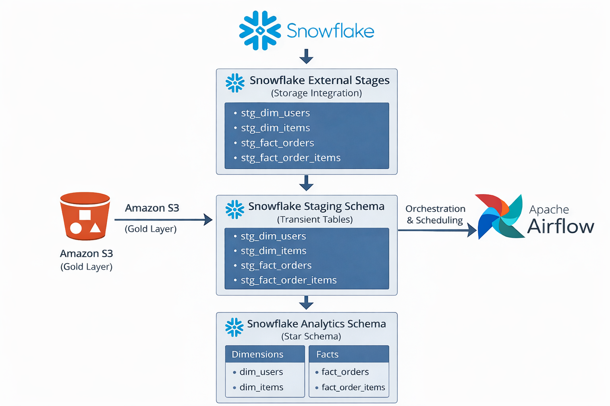

# 🛒 Ecommerce Snowflake Airflow Batch ETL Pipeline

[](https://airflow.apache.org/)
[](https://www.snowflake.com/)
[](https://aws.amazon.com/s3/)
[](https://www.python.org/)

A production-ready, end-to-end batch ETL data pipeline that orchestrates ecommerce data ingestion from Amazon S3 into Snowflake using Apache Airflow. Built with industry best practices for data engineering interviews and real-world deployments.

---

## 📌 Project Overview

This project demonstrates a **modern analytics architecture** for batch data processing, featuring:

- **External data storage** in S3 (Gold layer, Parquet format)
- **Staging schema** for controlled data ingestion
- **Analytics schema** for dimensional modeling (star schema)
- **Airflow orchestration** for scheduling, validation, and dependency management
- **Secure integration** using Snowflake Storage Integration (no hardcoded AWS keys)

---

## 🧱 Architecture




## 🛠️ Tech Stack

| Layer          | Technology        | Purpose                                    |
|----------------|-------------------|--------------------------------------------|
| Orchestration  | Apache Airflow    | Workflow scheduling and monitoring         |
| Data Warehouse | Snowflake         | Cloud data warehouse for analytics         |
| Storage        | Amazon S3         | External data lake (Gold layer)            |
| File Format    | Parquet           | Columnar storage for efficient queries     |
| Query Language | SQL               | Data transformations and loading           |
| Version Control| Git / GitHub      | Source code management                     |

---

## 📂 Repository Structure

```
ecommerce-snowflake-airflow-pipeline/
│
├── dags/
│   └── ecommerce_snowflake_batch_etl.py    # Main Airflow DAG
│
├── sql/
│   ├── staging/                             # S3 → Staging loads
│   │   ├── load_dim_users.sql
│   │   ├── load_dim_items.sql
│   │   ├── load_fact_orders.sql
│   │   └── load_fact_order_items.sql
│   │
│   ├── validate_staging_tables.sql          # Data validation checks
│   ├── staging_to_analytics.sql             # Staging → Analytics transformations
│   └── update_load_control.sql              # Incremental load tracking
│
├── snowflake/                                # One-time setup scripts
│   ├── storage_integration.sql              # AWS S3 integration setup
│   ├── init_setup.sql                       # Database, schemas, warehouses
│   └── staging_tables.sql                   # Staging table definitions
│
├── README.md                                 # This file
└── .gitignore
```

---

## 🚀 Getting Started

### Prerequisites

- **Snowflake Account** with ACCOUNTADMIN access
- **AWS S3 Bucket** with Gold layer data (Parquet format)
- **Apache Airflow** (2.0+) environment
- **Python 3.8+** with `apache-airflow-providers-snowflake`

### Step 1: Snowflake Setup (One-Time)

Run the following SQL scripts **in order** directly in your Snowflake worksheet:

#### 1️⃣ Create Storage Integration

```bash
# File: snowflake/storage_integration.sql
```

This creates a secure connection between Snowflake and your S3 bucket using an IAM role.

**Important**: After running this script, note the `STORAGE_AWS_IAM_USER_ARN` and `STORAGE_AWS_EXTERNAL_ID`. Use these to configure your AWS IAM role trust relationship.

#### 2️⃣ Initialize Database & Schemas

```bash
# File: snowflake/init_setup.sql
```

Creates:
- Database: `ecommerce_dw`
- Schemas: `staging`, `analytics`
- Warehouse: `ecommerce_wh`
- External stages for S3 data
- Dimension and fact tables
- Load control table for incremental processing

#### 3️⃣ Create Staging Tables

```bash
# File: snowflake/staging_tables.sql
```

Creates transient staging tables:
- `stg_dim_users`
- `stg_dim_items`
- `stg_fact_orders`
- `stg_fact_order_items`

### Step 2: Configure Airflow

#### Install Required Provider

```bash
pip install apache-airflow-providers-snowflake
```

#### Add Snowflake Connection

1. Navigate to Airflow UI → Admin → Connections
2. Click **"+"** to add a new connection
3. Configure:
   - **Connection ID**: `snowflake_conn`
   - **Connection Type**: `Snowflake`
   - **Account**: Your Snowflake account identifier
   - **Login**: Your Snowflake username
   - **Password**: Your Snowflake password
   - **Database**: `ecommerce_dw`
   - **Warehouse**: `ecommerce_wh`
   - **Schema**: Leave empty (managed in SQL files)

### Step 3: Deploy DAG

1. Copy the `dags/` and `sql/` folders to your Airflow home directory:

```bash
cp -r dags/ $AIRFLOW_HOME/dags/
cp -r sql/ $AIRFLOW_HOME/sql/
```

2. Verify DAG appears in Airflow UI
3. Enable the DAG: `ecommerce_snowflake_batch_etl`
4. Trigger manually or wait for scheduled run (daily at midnight UTC)

---

## 📊 ETL Pipeline Details

### Data Loading Strategy

| Table Type      | Load Strategy  | Method                                        |
|-----------------|----------------|-----------------------------------------------|
| **Dimensions**  | Full Refresh   | `TRUNCATE` → `INSERT SELECT` from staging     |
| **Facts**       | Incremental    | `INSERT SELECT` with date filter from control |

### Incremental Load Mechanism

The pipeline uses a **load control table** to track the last successful ingestion:

```sql
CREATE TABLE analytics.load_control (
    table_name VARCHAR(100),
    last_load_date DATE
);
```

**How it works**:
1. Fact tables filter data using `ingestion_date > last_load_date`
2. After successful load, `last_load_date` is updated
3. Next run processes only new data (idempotent and resumable)

### Why INSERT SELECT Instead of COPY INTO?

This project uses `INSERT INTO ... SELECT ... FROM @stage` for:

✅ **Type casting and transformations** during ingestion  
✅ **Metadata enrichment** (e.g., `load_timestamp`)  
✅ **Null handling** and data cleansing  
✅ **Clear, readable SQL** for learning and interviews  

> **Note**: For very large-scale raw ingestion (millions of rows), `COPY INTO` can be introduced as an optimization.

---

### 🔄 AirFlow Task Breakdown

| Task                    | Description                                              | SQL File                         |
|-------------------------|----------------------------------------------------------|----------------------------------|
| `load_stg_dim_users`    | Load users from S3 to staging                            | `load_dim_users.sql`             |
| `load_stg_dim_items`    | Load items from S3 to staging                            | `load_dim_items.sql`             |
| `load_stg_fact_orders`  | Load orders incrementally from S3 to staging             | `load_fact_orders.sql`           |
| `load_stg_fact_order_items` | Load order items incrementally from S3 to staging    | `load_fact_order_items.sql`      |
| `validate_staging_tables` | Ensure staging tables have data                        | `validate_staging_tables.sql`    |
| `load_analytics_tables` | Transform staging → analytics (dims & facts)             | `staging_to_analytics.sql`       |
| `update_load_control`   | Update last processed date for incremental loads         | `update_load_control.sql`        |

---

## 🔐 Security Best Practices

✅ **No hardcoded credentials**: Uses Airflow connections and Snowflake Storage Integration  
✅ **IAM role-based access**: S3 access via AWS IAM roles (no access keys)  
✅ **Principle of least privilege**: Storage integration restricted to specific S3 paths  
✅ **Schema isolation**: Staging and analytics layers are separated  

---

## 🧪 Testing & Validation

### Manual Testing Steps

1. **Verify S3 Data Exists**:
   ```sql
   LIST @ecommerce_dw.staging.users_stage;
   ```

2. **Test Staging Load**:
   ```sql
   SELECT COUNT(*) FROM staging.stg_dim_users;
   ```

3. **Check Analytics Data**:
   ```sql
   SELECT COUNT(*) FROM analytics.dim_users;
   SELECT COUNT(*) FROM analytics.fact_orders;
   ```

4. **Verify Incremental Load**:
   ```sql
   SELECT * FROM analytics.load_control;
   ```

---

## 📈 Monitoring & Troubleshooting

### Common Issues

| Issue                        | Solution                                                     |
|------------------------------|--------------------------------------------------------------|
| "Stage not found"            | Verify external stage exists and IAM role is configured      |
| "Empty staging tables"       | Check S3 file paths match stage definitions                  |
| "Incremental load skips data"| Verify `last_load_date` in load_control table is correct     |
| "Airflow connection fails"   | Test Snowflake credentials and warehouse state               |

### Airflow Monitoring

- **View DAG runs**: Airflow UI → DAGs → `ecommerce_snowflake_batch_etl`
- **Check task logs**: Click on individual tasks to view SQL execution logs
- **Set up alerts**: Configure email/Slack notifications for task failures

---

## 🔍 Exploratory Analysis (SQL)

In addition to the ETL pipeline, this project includes a set of **read-only exploratory SQL queries**
that demonstrate how the analytics tables can answer common e-commerce business questions.

The analysis covers:
- Overall revenue and order volume
- Daily revenue trends
- Top customers by total spend
- Best-selling products by revenue
- Order status distribution
- Customers with no orders
- Revenue contribution by product category

These queries are **not part of the Airflow DAGs** and are intended to showcase
how the warehouse supports downstream analytics and decision-making.

📄 Location: `sql/analysis/eda_business_questions.sql`  

---

## 📝 Future Enhancements

- Add basic data quality checks such as row count and empty-table validation in Airflow  
- Optimize large data loads by switching from `INSERT SELECT` to `COPY INTO`  
- Improve incremental loading using watermark-based or metadata-driven logic  
- Enable Airflow alerts (email/Slack) for task failures and long-running jobs  
- Introduce simple dev and prod environment separation using schemas and connections


---
## 📧 Contact

**Jatin Kumar**  

- LinkedIn: https://www.linkedin.com/in/jatin-kumar-8626a825a/
- GitHub: https://github.com/jatin-node 
- Email: jatin310522@gmail.com

⭐ If you find this project useful, feel free to star the repository.
